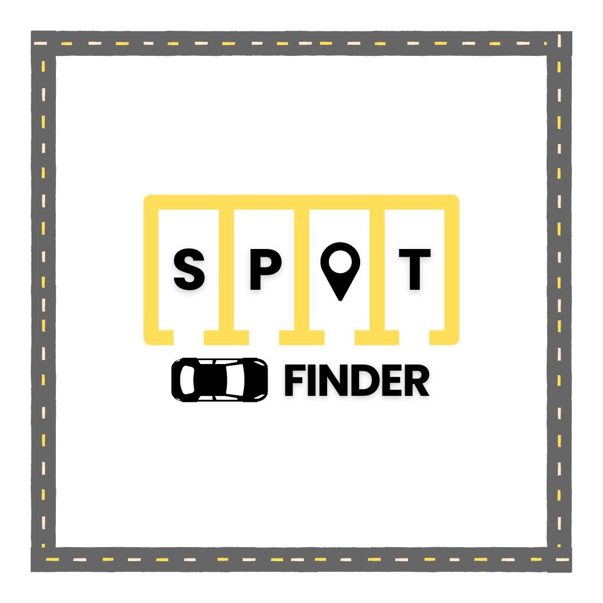

<div align="center" style="padding-top: 5px">



## SpotFinder
*Spot the Best, Park the Rest*

**SpotFinder:** *Your number one parking buddy, to help take out the stress of seeking and managing spaces to park. Whether you require a regular, VIP, or special needs accessible parking spot, SpotFinder's always available, right at your fingertips; reservations, and plain language pricing has you covered. Our system helps you reserve your space in advance and manage and cancel bookings in a way that makes parking easy for everyone. Forget parking headaches, and say hello to easy and convenient with SpotFinder, where we make it easy to find your perfect spot with just a click!*


</div>

## Contents

<div style="margin-left: 250px; margin-right: 250px;">

- [I. Overview](#i-overview)
- [II. The Application of Python in the Program](#ii-the-application-of-python-in-the-program)
- [III. Driving Sustainability: Integrating SDG Goals into SpotFinder](#iii-driving-sustainability-integrating-sdg-goals-into-spotfinder)
- [IV. Getting Started: How to Run SpotFinder](#iv-getting-started-how-to-run-spotfinder)

</div>

<!-- Overview of the Project starts here -->

<div style="text-align: justify;">

## I. Overview
&nbsp;&nbsp;&nbsp;&nbsp;&nbsp;&nbsp;**SpotFinder** *is a user friendly parking management system designed to simplify how you can find and reserve parking spaces. It is user friendly, efficient and accessible, where users can browse active parking slots in real time, reserve parking slots in advance and handle its bookings without any hassle. The system is inclusive and convenient for all with tailor made categories for Regular, VIP and PWD parking.*

&nbsp;&nbsp;&nbsp;&nbsp;&nbsp;&nbsp;*Parking slot data and reservations are stored and managed securely using an SQLite database and program logic is used to coordinate the interactions amongst cars and parking slots. The interactive console interface is an easy experience for users to view availability, update or cancel reservations and maintain efficient parking operations. It not only provides for engineers to enhance user satisfaction but also for sustainable urban development promoting smart mobility solutions.*

</div>

<div style="margin-left: 50px;">

## *Core Features*

</div> 

<div style="margin-left: 100px; margin-right: 100px; text-align: justify;">

 **1. Database Setup**
- *Creates a database (parking_management.db) with two tables:*
    - **reservations:** *Stores information about parking reservations.*
    - **parking_slots:** *Tracks parking slot details, including category, charge rate, and status.*

**2. Dashboard and User Interaction**
- *Displays a visually formatted dashboard and menu options include finding parking spots, making reservations, viewing bookings, updating or canceling reservations, and exiting the system.*

**3. Parking Slot Categories**
- *Parking slots are categories to:*
    - *Regular Parking*
    - *VIP Parking*
    - *PWD Parking*
- *Each category has its own charge rate for the first three hours and the availability status of each slots*

**4. Reservation Management**
- **View Available Parking:** *Displays the list of available parking slots per category.*
- **Reserve Parking:** *Once done viewing their preferred slot and its status, it allows user to book their reservation by entering details such as name, vehicle plate, and reservation time.*
- **View Reservations:** *Allows users to view their reservations in a table format for a cleaner and much understandable look.*
- **Update Reservations:** *Gives users a option on what to update details like name, vehicle plate, contact information, or date and time.*
- **Delete Reservations:** *Allows the users to cancel their preferred reservations and updates the slot status to "Available".*

**5. Database Updates**
- *Automatically populates the parking slots if the database is empty.*
- *Ensures consistent pricing updates for each parking category.*
- *Updates the database if the user updated his or her reservation*

**6. Error Handling**
- *Basic checks for invalid user inputs, unavailable slots or attempting to book an already reserved slot*

</div>

<!-- Overview of the Project ends here here -->

<!-- Application of Python starts here -->

## II. The Application of Python in the Program 

<!-- Application of Python ends here -->

<!-- SDG of the program starts here -->

## III. Driving Sustainability: Integrating SDG Goals into SpotFinder 
&nbsp;&nbsp;&nbsp;&nbsp;&nbsp;&nbsp;The **Sustainable Development Goal (SDG)** that is mostly aligned to SpotFinder is **SDG 11: Sustainable Cities and Communities**, specifically targeting **sustainable urban planning and mobility**. Here's a more detailed explanation to why this system integrates and supports SDG 11: 

<div style="margin-left: 50px; margin-right: 50px; text-align: justify;">

- *It also supports parking slot allocation which has optimized time in finding parking. In so doing it adds to the urban mobility by reducing the traffic congestion brought about by vehicles' circular motions looking / travelling for parking.*
- **PWD Parking:** *Goals of inclusivity are met through dedicated slots for persons with disabilities (PWD) with no charges to offer the PWD equitable access to facilities.*
- *It provides access to all people to fair and transportation options available.*
- *Parking reservation control prevents idling or errant vehicle routes through the city and therefore reduces fuel consumption and emissions.*
- *This kind of system can be used in conjunction with smart city infrastructure in order to stimulate environmentally friendly transportation systems.*
- *By doing so, less spurious parking is pre reserved and more traffic flow, contributing to safer roads and communities.*

</div>

&nbsp;&nbsp;&nbsp;&nbsp;&nbsp;&nbsp;This combines the work of SDG 11 by tackling urban mobility problems, encouraging inclusion, minimising environmental impact, and enhancing the support for the modern urban infrastructure. Currently developing technology for parking management, a foundation of its work can be extended to broader sustainable urban development efforts.

<!-- SDG of the program ends here -->

<!-- How to Run SpotFinder starts here -->

## IV. Getting Started: How to Run SpotFinder

<div style="text-align: justify;">

**SpotFinder** is a type of program made from Python programming language. It is a parking management system that helps the users find available parking slots, reserve spots, view, update, and cancel reservations. This program supports a SQLite database to manage parking slot (availability status and charge per hour) and reservation data. 

## Instructions 
&nbsp;&nbsp;&nbsp;&nbsp;&nbsp;&nbsp;*Follow these steps to run and interact with the program.*
</div>

<div style="margin-left: 50px; margin-right: 50px;"> 

**1. Install the Required Pre-requisites.**
- *To run the program, ensure that you have Python 3.7 or higher installed. Also, this program uses SQLite3 Database, in which it is pre-installed together with Python, so no additional necessary installation is required for this part.*

**2. Save the Program.**
- *Copy the program code and paste it into an empty text editor, may it be from VS Code or Notepad. Save the file and name it as "parking_management.py"*

**3. Create a Directory**
- *Save the file in a dedicated directory. Once the program is being executed, the SQLite database (parking_management.db) will then be created here, ensuring that the Python file and the database are in the same location.*

**4. Run the Program**
- *Open a terminal or command prompt.*
- *Navigate to the directory in which the file is saved/stored.*
```bash
cd path/to/your/script/folder
```
- *Execute the program by typing:*
```bash
python parking_management.py
```

**5. Interacting with the system.**
- **Dashboard and Menu**
    - *This program will display a dashboard and menu with options such as finding a spot, reserving a space, or exiting the system. This will prompt the user to enter the corresponding number to select an option.*
    <p align="center">
    
    </p>

- **Find A Spot**
    - *This will allow the user to enter the number to view the category of parking.*
    <p align="center">
    
    </p>

    - *This allows the user to view available slots per category.*
    <p align="center">
    
    </p>

- **Reserve your Space**
    - *This prompts the user to enter their details such as the chosen parking slot number, their name, vehicle plate number, contact number, and the date and time of their reservation.* 
    - *After entering the details, the user will have a view of their confirmed reservation in a table format.*

    <p align="center">
    
    </p>

- **See your Bookings**
    - *This allows the user to view their recent reservations.*

    <p align="center">
    
    </p>

- **Update your Reservation**
    - *This will prompt the user to enter the reservation ID that they've made that they want to update. After that, They will enter a number from the options on what to update on their chosen reservation which is the Name, Vehicle Plate Number, Contact Number, and the Date and Time of their Reservation.*

    <p align="center">
    
    </p>

- **Cancel your Reservation**
    - This will prompt the user to enter the reservation ID that they've made that they want to cancel. If the user wish to continue the cancellation, then the user must select the `1. Yes` option. Otherwise, if the user doesn't want to continue the cancellation or having second thoughts, then they must select the `2. No` option. Selecting `3. Return to Dashboard` will just return the user to the main dashboard of the program. 

    <p align="center">
    
    </p>

- **Exit**
    - *Select option `6. Exit` from the menu to close the program safely.* 

*Enjoy managing your parking spaces efficiently with* **SpotFinder!**
</div>